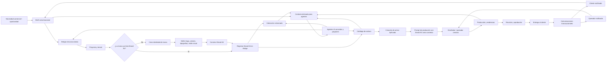

# Flujo Brand Kit Adobe V1

**ID:** ARCH-20260526-01  
**Proyecto:** Bridge  
**Fecha:** 2026-05-26  
**Última revisión:** 2026-05-28  
**Estado:** Documento de flujo operativo

## Propósito

Registrar el flujo de negocio para el uso de Brand Kit dentro de Bridge.

La regla operativa es esta:

- Bridge es la fuente de verdad del Brand Kit del cliente (logo, colores, tipografías, estilo visual);
- si el cliente ya tiene Brand Kit, se registra en Bridge y se usa como base para la producción creativa;
- si el cliente no tiene marca definida, primero se crea la identidad de marca y se guarda en Bridge;
- ambos caminos convergen en la producción creativa con Brand Kit disponible en Bridge.

## Flujo principal

## Responsabilidad por tramo

- El operador valida si la marca ya existe y decide si se reutiliza o si se crea desde cero.
- El diseñador traduce la identidad visual definida a los activos de producción.
- Bridge almacena el Brand Kit del cliente como fuente de verdad accesible por agentes y diseñadores.
- Los prompts de producción incluyen el Brand Kit como contexto para herramientas IA (Adobe Firefly u otras).
- Los agentes IA consultan el contexto derivado y proponen sin romper la fuente de verdad.

## Regla clave

El Brand Kit no es un paso obligatorio para todos los clientes.

Es una capa de entrada que se usa de una de estas dos formas:

1. marca existente: se registra el Brand Kit del cliente en Bridge;
2. marca inexistente: se crea primero la identidad, se construye el Brand Kit y se guarda en Bridge.

En ambos casos, la producción creativa ocurre después de que el Brand Kit esté registrado en Bridge.

## Pendiente técnico

Bridge aún no tiene tabla ni campos para almacenar Brand Kit. Se requiere diseñar la estructura de datos (ver backlog `ARCH-20260510-11`). Opciones evaluadas:

- campo `brand_kit jsonb` en tabla `clients` — simple, suficiente para V1;
- tabla separada `brand_kits` vinculada a `clients` — más extensible si hay múltiples versiones de marca.
