# Flujo Brand Kit — Bridge V1

**ID:** ARCH-20260526-01  
**Proyecto:** Bridge  
**Fecha:** 2026-05-26  
**Última revisión:** 2026-05-28 (v2 — cotización como gate obligatorio)  
**Estado:** Documento de flujo operativo

## Propósito

Registrar el flujo de negocio para el uso de Brand Kit dentro de Bridge.

La regla operativa es esta:

- Bridge es la fuente de verdad del Brand Kit del cliente (logo, colores, tipografías, estilo visual);
- el diagnóstico de si tiene o no Brand Kit informa el **scope y costo** de la cotización, pero no ejecuta ningún trabajo todavía;
- la cotización debe ser **aprobada por el cliente** antes de registrar o construir el Brand Kit;
- solo después de la aprobación se ejecuta el camino correspondiente (registrar o crear desde cero).

## Flujo principal

```mermaid
flowchart LR
    A[Necesidad comercial / oportunidad] --> B[Brief conversacional]
    B --> C[Bridge estructura datos]
    C --> D[Proyecto y tenant]
    D --> E{¿La marca ya tiene Brand Kit?}

    E -- "Sí — scope: solo activos" --> J[Cotización versionada]
    E -- "No — scope: incluye Brand Kit" --> J

    J --> JA[Cliente aprueba cotización]

    JA -- Sí tiene Brand Kit --> F[Registrar Brand Kit en Bridge]
    JA -- No tiene Brand Kit --> G[Crear identidad de marca]
    G --> H[Definir logo, colores, tipografías, estilo visual]
    H --> I[Construir Brand Kit]
    I --> F

    F --> K[Catálogo de activos]
    K --> L[Creación de activo tipificado]
    L --> M[Prompt de producción con Brand Kit como contexto]
    M --> N[Diseñador / operador creativo]
    N --> O[Producción y evidencias]
    O --> P[Revisión y aprobación]
    P --> Q[Entrega al cliente]

    B --> R[Contexto derivado para agentes]
    J --> R
    K --> R
    O --> R
    R --> S[Agentes IA consultan y proponen]
    S --> C
    S --> J
    S --> K

    Q --> T[Comunicaciones transaccionales]
    T --> U[Cliente notificado]
    T --> V[Operador notificado]

    U --> B
    V --> N
```

## Responsabilidad por tramo

- El operador diagnostica si la marca ya existe y lo refleja en el brief — eso define el scope de la cotización.
- La cotización incluye o no la creación del Brand Kit según el diagnóstico; debe ser aprobada antes de producir nada.
- Solo con cotización aprobada se registra o construye el Brand Kit en Bridge.
- El diseñador traduce la identidad visual definida a los activos de producción.
- Bridge almacena el Brand Kit del cliente como fuente de verdad accesible por agentes y diseñadores.
- Los prompts de producción incluyen el Brand Kit como contexto para herramientas IA.
- Los agentes IA consultan el contexto derivado y proponen sin romper la fuente de verdad.

## Regla clave

El Brand Kit no puede ejecutarse sin cotización aprobada.

El diagnóstico (`E`) ocurre en el brief y determina el alcance de la cotización:

1. **marca existente**: cotización cubre solo los activos solicitados → aprobación → se registra el Brand Kit en Bridge;
2. **marca inexistente**: cotización incluye la creación de identidad + activos → aprobación → se crea el Brand Kit y se guarda en Bridge.

En ambos casos, la producción creativa ocurre después de que el Brand Kit esté registrado en Bridge y la cotización esté aprobada.
