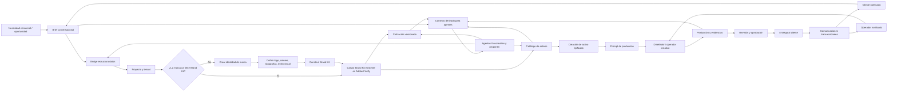

# Flujo Brand Kit Adobe V1

**ID:** ARCH-20260526-01  
**Proyecto:** Bridge  
**Fecha:** 2026-05-26  
**Estado:** Documento de flujo operativo

## Propósito

Registrar el flujo de negocio para el uso de Brand Kit en Adobe dentro de Bridge.

La regla operativa es esta:

- si el cliente ya tiene Brand Kit, se carga en Adobe Firefly y se usa como base de consistencia visual;
- si el cliente no tiene marca definida, primero se crea la identidad de marca como un flujo aparte;
- ambos caminos convergen en la producción creativa.

## Flujo principal

## Responsabilidad por tramo

- El operador valida si la marca ya existe y decide si se reutiliza o si se crea desde cero.
- El diseñador puede ayudar a traducir la identidad visual a la herramienta Adobe.
- Adobe Firefly produce dentro de la base de marca existente.
- Bridge conserva el contexto, el historial y la trazabilidad del flujo.
- Los agentes IA consultan el contexto derivado y proponen sin romper la fuente de verdad.

## Regla clave

El Brand Kit no es un paso obligatorio para todos los clientes.

Es una capa de entrada que se usa de una de estas dos formas:

1. marca existente: se carga el Brand Kit del cliente en Adobe Firefly;
2. marca inexistente: se crea primero la identidad y luego se construye el Brand Kit.

En ambos casos, la producción creativa ocurre después de esa base de marca.
